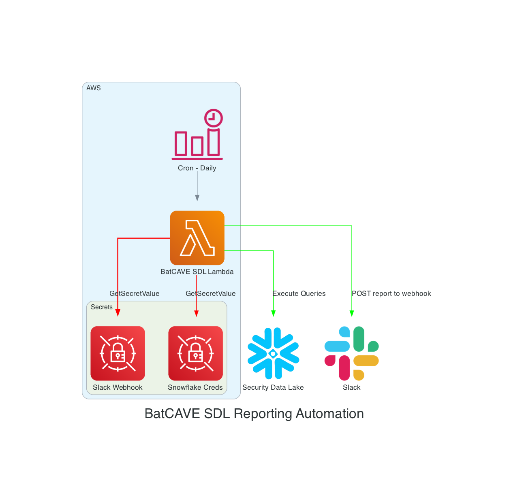

# BatCAVE SDL Daily Reporting

This repo contains the code for the BatCAVE Security Data Lake daily reporting automation.

## Overview

The BatCAVE SDL reporting automation allows for the BatCAVE security team to get daily analytics from the CMS Security Data Lake and post them into the #BatCAVE-Security-Alerts slack channel for ease of use. Current data reported:
-  Latest SecurityHub Issues (excluding Nessus, GuardDuty, and Inspector) across BatCAVE environments in the last 24 hours
- Vulnerabilities from Nessus present in the CISA KEV list
- Vulnerabilities from Nessus above a preconfigured EPSS threshold (set with EPSS_THRESHOLD Lambda environment variable)

## Architecture

1. AWS EventBridge Cron Rule triggers the Reporting Lambda daily
2. Reporting Lambda retrieves slack webhook and snowflake credentials from secrets manager
3. Reporting Lambda retrieves EPSS and KEV list from respective URLs into a Pandas dataframe
4. Reporting Lambda executes queries against the SDL to retrieve Nessus and SecurityHub data
5. Report is formatted into slack blocks, and post payload to BatCAVESecurityHubFindings slack app incoming webhook

## Deployment and Maintenance 

Lambda is deployed as a [container image](code/reporter/Dockerfile) deployment package by the CDK template

Assuming the account is bootstrapped:

`cdk deploy -r arn:aws:iam::863306670509:role/delegatedadmin/developer/cdk-hnb659fds-cfn-exec-role-863306670509-us-east-1`

Generate arch diagram (with [mingrammer](https://diagrams.mingrammer.com) and graphviz installed):

`python diagram.py`

Teardown:

`cdk destroy -r arn:aws:iam::863306670509:role/delegatedadmin/developer/cdk-hnb659fds-cfn-exec-role-863306670509-us-east-1`
